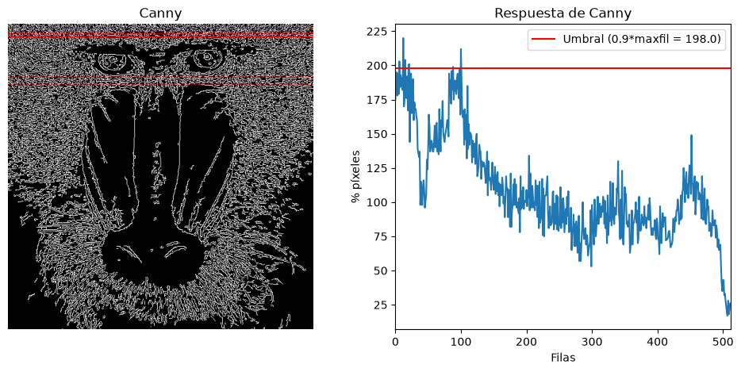
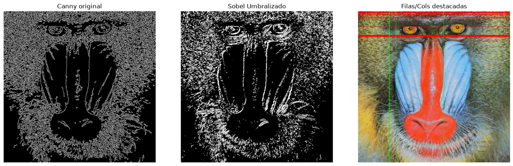

## Práctica 2. Funciones básicas de OpenCV

## Autores: José Miguel Ojeda Hernández (GitHub: https://github.com/JoseOjeda14) y Yenedey Morán Delgado (GitHub: https://github.com/Yenedey36)

## Tarea 1: Análisis de Densidad de Bordes con Canny (Por Filas)

En esta primera tarea realizamos un recuento algorítmico del número de píxeles correspondientes a contornos (píxeles blancos) detectados por el operador de Canny, focalizando nuestro análisis en la distribución por filas de la imagen.

Pasos técnicos de la implementación:

1. Conteo por reducción matricial: Utilizamos la función cv2.reduce (aplicando el parámetro 1 para operar horizontalmente y cv2.REDUCE_SUM) sobre la matriz binaria resultante de Canny. Al dividir el vector aplanado (flatten()) entre 255, obtenemos la cantidad exacta de píxeles de borde presentes en cada fila.

2. Cálculo de umbrales y filtrado: Apoyándonos en la librería NumPy (np.max y np.where), calculamos el valor máximo absoluto de píxeles blancos en una fila (maxfil). Con este dato, extraemos e imprimimos por consola las posiciones exactas y el número total de filas que alcanzan o superan el 90% de dicho máximo.

3. Primitivas gráficas: Convertimos la imagen de Canny de escala de grises a espacio de color (cv2.cvtColor). Esto nos permite usar la primitiva cv2.line para trazar líneas de color de extremo a extremo justo sobre las coordenadas de las filas que han superado la nota de corte.

4. Representación analítica: Para la visualización final, empleamos matplotlib generando un panel dual (plt.subplot). A la izquierda mostramos la imagen remarcada, y a la derecha renderizamos un gráfico (plt.plot) con la distribución de densidad de píxeles por fila, incluyendo una línea de referencia (plt.axhline) que ilustra visualmente el umbral del 90%.

Visualización del resultado:

## Tarea 2: Análisis de Bordes con Sobel y Canny (Imagen del Mandril). 

En esta tarea hemos implementado un algoritmo para detectar y resaltar automáticamente las zonas con mayor densidad de bordes o texturas en una imagen, comparando los resultados entre distintos operadores.

Pasos técnicos de la implementación:

Detección y Umbralizado: Partiendo de la imagen procesada con el operador de Sobel (convertida a 8 bits mediante cv2.convertScaleAbs), aplicamos la función cv2.threshold con el parámetro cv2.THRESH_BINARY. 

Conteo de densidad (Filas y Columnas): Para analizar la concentración de bordes, utilizamos la función cv2.reduce con la operación cv2.REDUCE_SUM. Aplicando esta reducción tanto en la dimensión 0 (columnas) como en la 1 (filas) y dividiendo entre 255, obtenemos el recuento exacto de píxeles blancos por cada vector.

Cálculo de Máximos y Primitivas Gráficas: Extraemos los valores máximos absolutos con np.max(). Mediante bucles convencionales, identificamos las filas y columnas que superan el 90% de este máximo y las remarcamos sobre la imagen original en color usando primitivas de dibujo (cv2.line), utilizando rojo para las horizontales y verde para las verticales.

Visualización y Comparativa: Utilizamos matplotlib.pyplot (plt.subplots y tight_layout) para mostrar los resultados de forma clara.

Conclusión Sobel vs Canny: Al visualizar los resultados, se observa claramente que Sobel (al aplicarle un umbral básico) genera bordes mucho más gruesos y detecta demasiada textura de la imagen (como el pelo del mandril), lo que ensucia el resultado. Por el contrario, el algoritmo de Canny aplica filtros adicionales que consiguen afinar esos bordes hasta dejarlos en líneas limpias y continuas de un solo píxel de grosor, definiendo mucho mejor las siluetas principales. 
Ejemplo visual del resultado:

## Tarea 3: Interacción en Tiempo Real mediante Detección de Movimiento.

Pasos técnicos de la implementación:

Detección de Movimiento: Partiendo del fotograma actual,convertido a escala de grises y suavizado con cv2.GaussianBlur para reducir el ruido estático, calculamos la diferencia absoluta (cv2.absdiff) respecto al fotograma inmediatamente anterior. A este resultado le aplicamos una binarización con cv2.threshold y limpiamos los artefactos visuales diminutos mediante una operación morfológica de apertura (cv2.morphologyEx con cv2.MORPH_OPEN).

Análisis Vectorizado de Proporciones: Para determinar la intensidad y ubicación de la acción, dividimos la máscara binaria resultante en dos mitades (izquierda y derecha) utilizando el rebanado matricial (slicing) de NumPy. Mediante np.count_nonzero dividido por el tamaño total del sector (zona.size), obtenemos la proporción exacta de píxeles en movimiento para cada lado.

Extracción de Contornos y Puntos de Interacción: Aplicamos cv2.findContours sobre la máscara de movimiento para aislar las formas resultantes. Utilizando bucles y cv2.contourArea, filtramos aquellos contornos demasiado pequeños o demasiado grandes. Sobre los contornos válidos, trazamos una caja delimitadora (cv2.boundingRect) y extraemos su punto central exacto (coordenadas cx e cy), las cuales actuarán como las "manos" físicas del usuario dentro del programa.

Colisiones: Se implementó una lógica de control de estado basada en diccionarios para gestionar la aparición, posición y velocidad de múltiples pelotas simultáneas. El algoritmo evalúa los límites de la pantalla para detener las pelotas. Para la interacción, se calcula la distancia absoluta entre las pelotas y los centros de movimiento (cx, cy); si ocurre una colisión, la pelota adquiere la coordenada X del usuario, utilizando np.clip para impedir que cruce la frontera central de la pantalla.

Visualización y Conclusión: El resultado se plasma sobre el fotograma original, volteado con cv2.flip para un efecto espejo más intuitivo. Al observar el programa en ejecución, se comprueba que sustituir la iteración de píxeles píxel a píxel por operaciones matemáticas matriciales de NumPy, sumado a un correcto filtrado morfológico, permite rastrear el movimiento humano y gestionar colisiones en tiempo real.

Ejemplo visual del resultado:

<video src="Video%20Pelotas.mp4" autoplay loop muted playsinline width="100%"><video>
